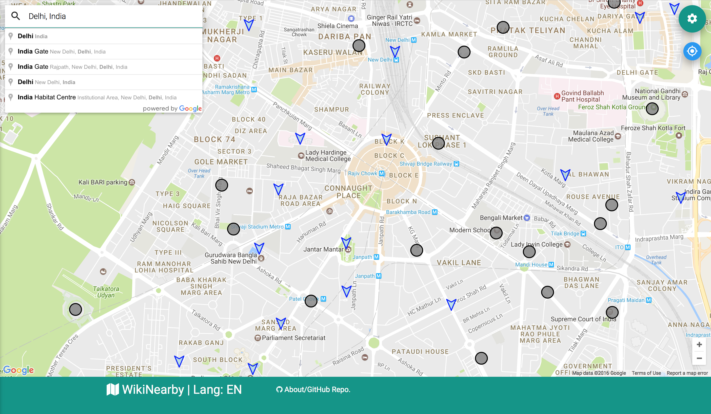
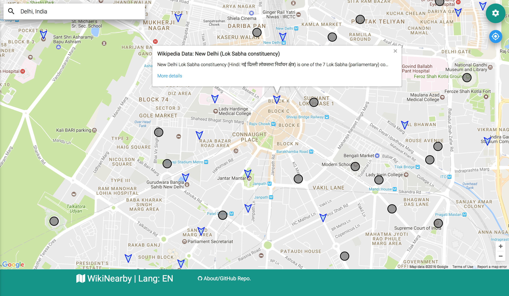
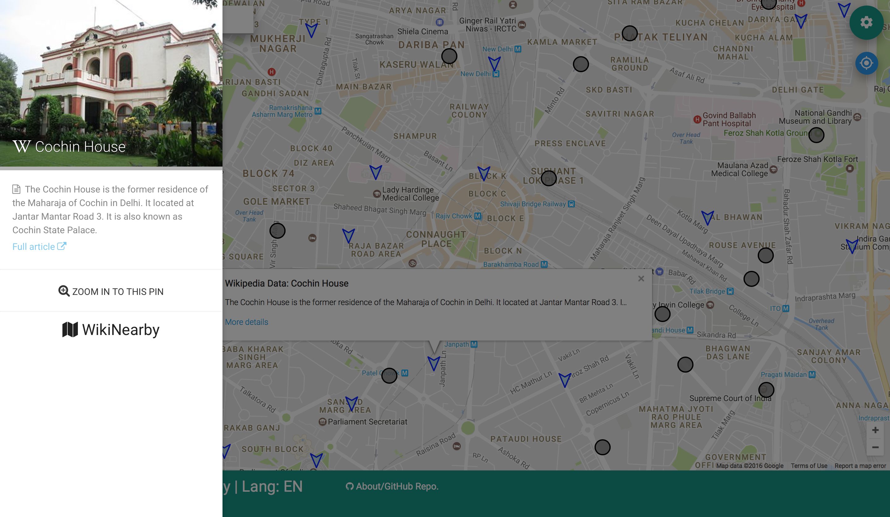
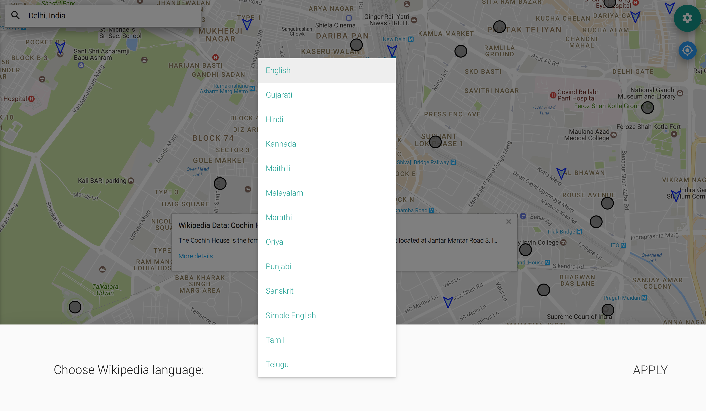

<a href="http://wikinearby.in/">

	

</a> 

# http://wikinearby.in

 
 

"WikiNearby" is a web application to annotate Google Maps with geotagged Wikipedia articles in various Indian languages.  

Code documentation is available <a href="http://agarwalt.github.io/WikiNearby/" target="_blank">here</a>.

### Screenshots

	

 

	

 

	

 

	

 
